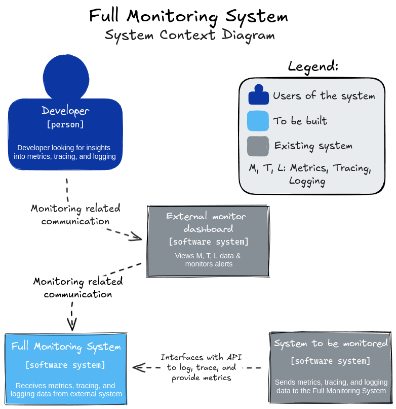
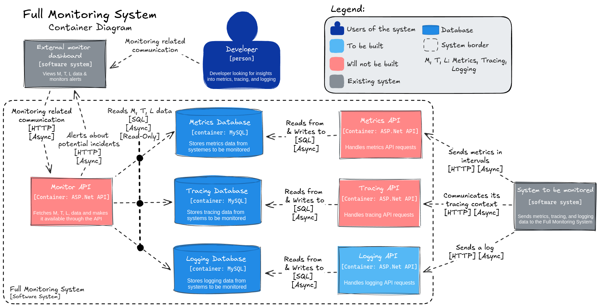
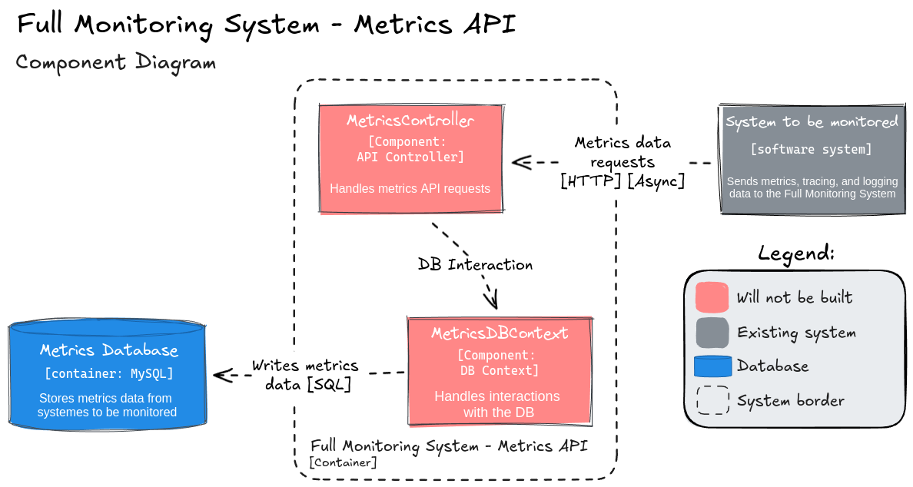
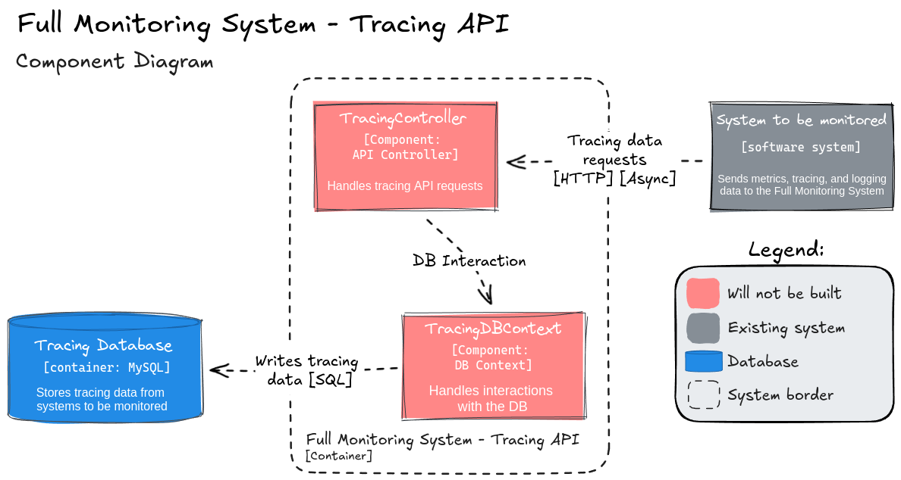
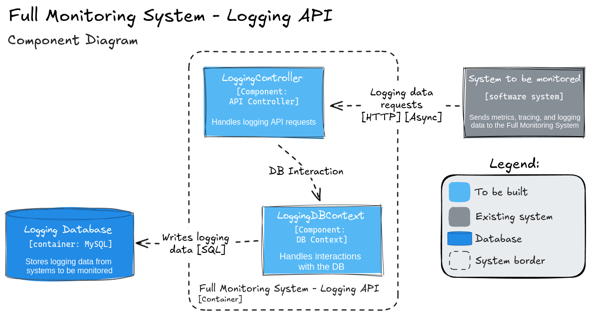
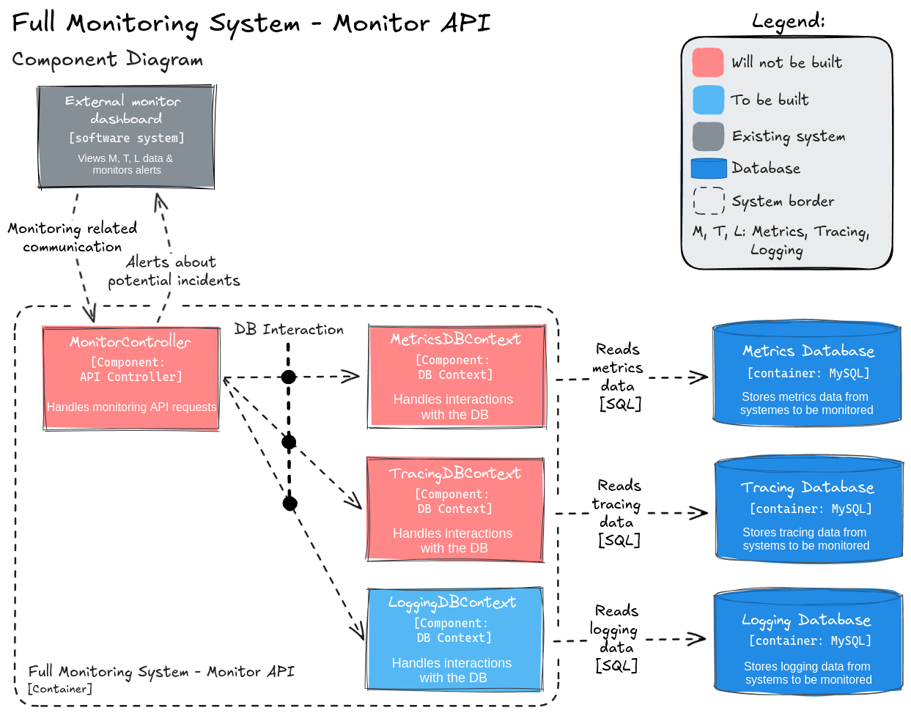

# Full Monitoring System Design + API Container & DB docker-compose
This is a compulsory assignment for Development of Large Systems Week 39+40.  

`In this compulsory assignment you must design a full monitoring system using the C4-modelling framework described in the prepare section of these weeks.
Furthermore you must also code one of the API-containers from the level 2 diagram that uses a database.`

The C4 Model is to be used to design a monitoring system for external systems, such that metrics, tracing, and logging can be provided as a service.

## Choice of User / User type:
A developer should use our System. As the user of the system needs expertise / knowledge about Monitoring, a regular user would be overwhelmed.

## Dashboard is external:
The choice to use an external dashboard lies in the fact, that many expert solutions exist. Different users have different preferences:
allowing the user to make the choice themselves. This adds modularity to the system and users who are experts in Grafana for instance can use their expertise from Grafana. To get to the point, the developers could use their already accrued expertise / knowledge and it would faster integration for the systems. More customiseability.

Made by Asbjørn ([github](https://github.com/AsbjrnJacobsen)) & Esben ([github](https://github.com/eldahl))

# Usage
Run `docker-compose up`, and use Postman, or another HTTP client to run the following requests:  

## PostLog | POST
Posts a log to the Logging API.  
`http://localhost:8080/api/Logging/PostLog` using request body:
```json
{
    "systemIdentifier": "dce9d1fa-e338-41c3-8642-88899ddbfea6",
    "sessionIdentifier": "9cb68678-d352-403e-86bc-27cbc9d1207b",
    "severity": 5,
    "message": "FATAL: SELF DESTRUCTION IMMINENT!"
}
```

## GetExample | GET
Gets an example of a log, for easy formatting assimilation.  
`http://localhost:8080/api/Logging/GetExample`  

## GetLogs | GET
Gets all logs from the database.  
`http://localhost:8080/api/Logging/GetLogs`  

# Diagrams
Below are the C4 diagrams, outlining the design of the system.  
No level 4 diagrams have been made.

<p align="center">
  
</p>
<p align="center">
  
</p>
<p align="center">
  
</p>
<p align="center">
  
</p>
<p align="center">
  
</p>
<p align="center">
  
</p>
